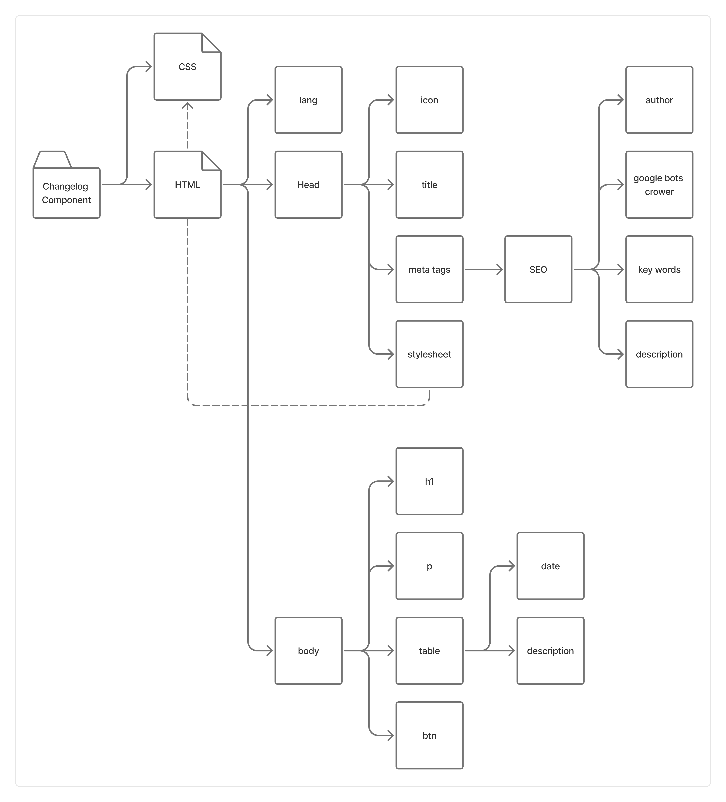

# Changelog-Component
A simple component for a website that displays a changelog

## Architecture & Planning

<!-- TODO: ## Design Decisions (Explain in 2-3 lines the decisions made, e.g., the rationale behind choosing CSS Grid for this component, etc.) -->

## Challenges & Solutions

### Challenge: Scoping & Component Breakdown
- Translating a full changelog layout into a structured, modular HTML/CSS architecture without prior reference.

**Solution:**
- Designed an architectural [diagram](#architecture--planning) to map layout hierarchy and decomposed the interface into reusable, semantic box components before writing code.

## 💡 What I Learned

During this project, I focused not only on HTML structure but also on maintaining professional engineering workflows:

- **Conventional Commits Best Practices:** Learned that the `scope` in commit messages should represent the logical module or domain (e.g., `feat(changelog): ...`) rather than the physical file name (`feat(index.html)`), keeping the commit history scalable and clear.
- **Accurate Terminology:** Understood the importance of precise domain language—distinguishing between a generic *Table of Contents* and specific *Changelog entries/records*.
- **Shell Quoting Safety in Git:** Learned the distinction between strong quoting (`'...'`) and weak quoting (`"..."`) in terminal shells like Zsh and Bash. Using outer single quotes treats commit messages as literal raw strings, preventing the shell from accidentally parsing special characters (like `!`, `$`, or backticks) through history expansion or variable interpolation.